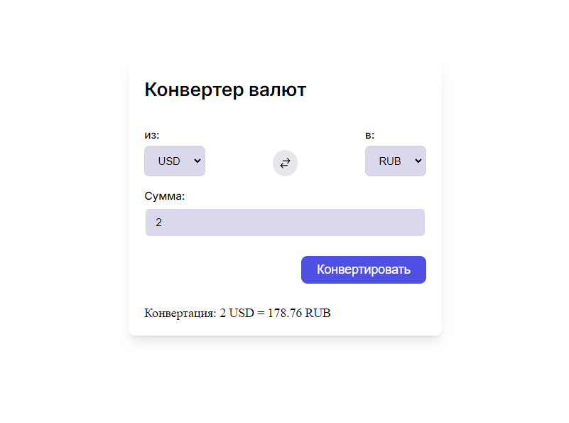

# Конвертер валют

Демонстрация навыков верстки и JS 

## Содержание

1. Заголовки
2. Тексты
3. Картинки
4. Кнопки
5. Формы
6. Работа с API

## Установка

Скопировать все содержимое и запустить index.html

1. Клонируйте репозиторий:
git clone  https://github.com/DevAnatoly/currency-converter.git

## Контакты
**Имя:** Анатолий  
**Email:** dev.anatoly.av@yandex.ru